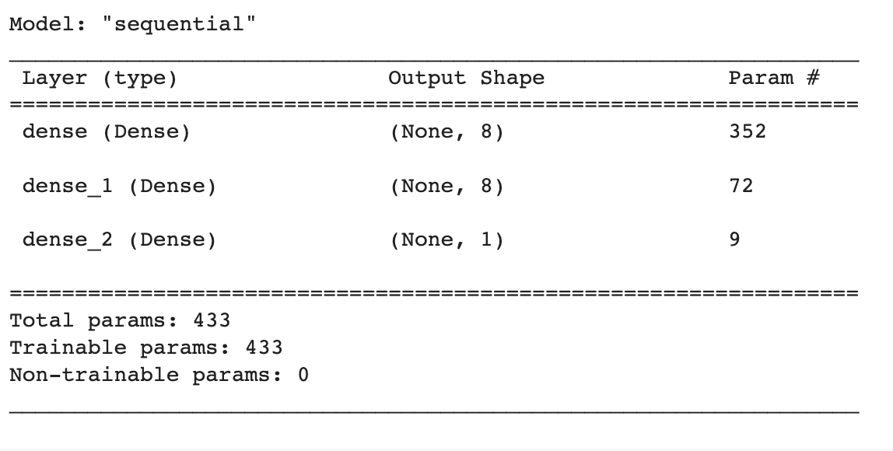
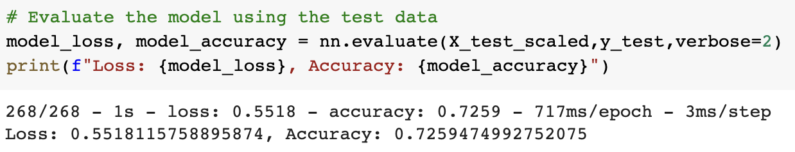
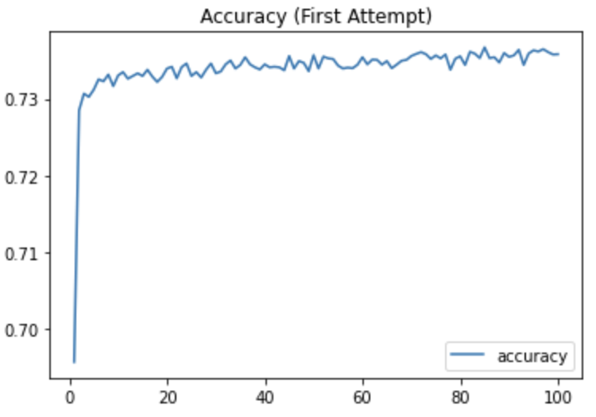
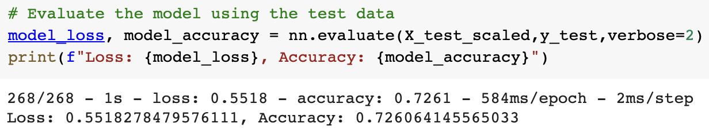
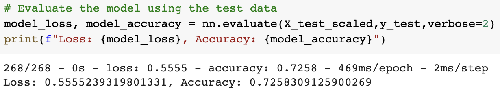
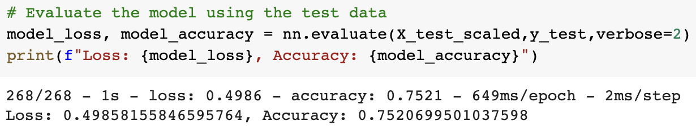
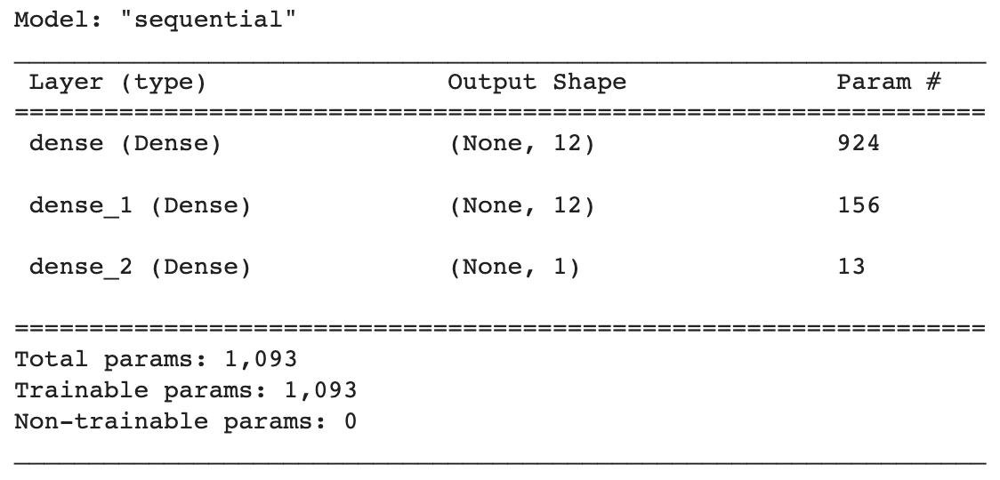
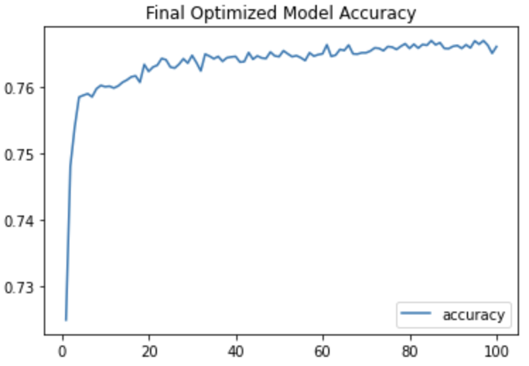

# Deep-Learning-Challenge

## Glen Dagger

# Overview

The purpose of this analysis is to use a neural network model to predict whether a charity will be successful based on various features, including the charity's affiliation, classification, use case, organization, status, income amount, special considerations, and asking amount. The model is created using TensorFlow and Keras in Google Colab and uses labeled data from a csv file containing nearly 35,000 rows of data.

# Results

### Data Preprocessing

- The csv file was read into the notebook as Pandas dataframe.
- The target variable was defined as the "IS_SUCCESSFUL" column, containing binary outputs.
- The "NAME" and "EIN" identification columns were dropped from the table as they were originally identified as neither targets nor features.
- The feature variables were defined as the rest of the columns: application_type, affiliation, classification, use_case, organization, status, ask_amt, income_amt, and special_considerations.
- Columns exceeding 10 unique values were condensed: application types with counts of less than 500 and classifications with counts of less than 1000 were binned together and labeled as "Other" in each respective column.
- The columns containing categorical data were converted to numeric data types using the get_dummies function for one-hot encoding.
- The dataset was finally split into testing/training datasets and scaled by creating a StandardScaler instance, fitting it to the features dataset, and scaling both training and testing datasets. The training dataset consisted of 25724 rows of data and 43 feature columns, while the testing dataset consisted of 8575 rows.

### Compiling, Training, and Evaluating the Model
#### Initial Model

- For the first neural network model, I used an input layer with an input dimension of 43, two hidden layers with 8 neurons each. I found that increasing the number of neurons and layers ultimately did not have a significant impact on the model's accuracy.
- Each layer used a ReLU activation function while the output layer used a sigmoid activation function.
- 

- The model was compiled and fit to the scaled training data for 100 epochs.
- The initial model scored an accuracy of around 72.6% and loss of about 55.2%.

#### Optimization

- To optimize the model, I first tried increasing the number of neurons in each hidden layer. I found that changing the number of neurons did not have much of an impact on the final results and increased the computational time significantly.

- I then tried increasing the number of hidden layers to 3. This had no impact on the loss and accuracy scores (in fact it slightly decreased by a tenth of a percent). The final optimization model contained 2 hidden layers with 12 neurons each. 

- I adjusted the binning of the "classifications" column values, setting the threshold to a lower value of 100 instead of the initial 1000. Again, this barely affected the overall accuracy after 100 epochs (remained around 72.6% with a loss score of 55.6%)

- Finally, I tried reintroducing the "name" column as a feature. Since it contained nearly 20000 unique values, I combined all charity names with fewer than 100 unique values into an "Other" category. This increased the accuracy score by around 3 percentage points (to 75.2%) and decreased the loss score by about 6 percentage points (to roughly 50%).

# Summary

Overall, the optimized model met the 75% accuracy threshold. The final optimized model had 76 features compared to the 43 features in the original model. It included 2 hidden layers with 12 neurons each, using ReLU activation functions for both. THe output layer used a sigmoid activation function.

Directly below is a graph to visualize the model's accuracy on the training data over the first 100 epochs:

Since we are classifying binary outputs, I would try using a logistic regression on this dataset to see if the accuracy and loss measures are improved. 

Describe how you could use a different model to solve the same problem, and explain why you would use that model (6)